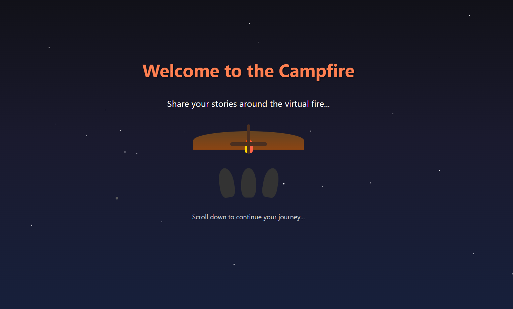

# Campfire Storytelling App 🔥

An immersive, interactive storytelling experience around a virtual campfire with voice recognition and AI-powered attentive listeners.



## 🌟 Features

- **🎤 Voice-Powered Storytelling**: Speak your stories naturally - no typing required
- **🏕️ Immersive Campfire Atmosphere**: Virtual campfire with flickering flames and twinkling stars
- **🤖 AI Attentive Listeners**: 3 AI personas that actively listen and respond thoughtfully
- **💬 Real-time Conversations**: Session-based memory for continuous storytelling
- **🌃 Nighttime Theme**: Dark, mystical interface perfect for storytelling
- **📱 Responsive Design**: Works on all devices

## 🚀 Quick Start

### Prerequisites
- Node.js 16+
- Python 3.11+
- Google AI API Key

### Installation & Setup

1. **Clone the repository**
   ```bash
   git clone https://github.com/Jay-tech456/StoryTelling_APP.git
   cd StoryTelling_APP
   ```

2. **Backend Setup**
   ```bash
   cd Backend
   # Create virtual environment
   python -m venv venv
   # Activate on Windows
   venv\Scripts\activate
   # Activate on macOS/Linux
   source venv/bin/activate

   # Install dependencies
   pip install -r requirements.txt

   # Set up environment variables
   # Copy .env and add your Google AI API key
   GOOGLE_API_KEY=your_api_key_here
   ```

3. **Frontend Setup**
   ```bash
   cd Frontend/myapp
   npm install
   ```

### Running the Application

#### Option 1: Docker (Recommended)
```bash
# From project root
docker-compose up --build
```

#### Option 2: Manual Setup
```bash
# Backend (Terminal 1)
cd Backend
uvicorn main:app --reload --port 8000

# Frontend (Terminal 2)
cd Frontend/myapp
npm start
```

### Access Your App
- **Frontend**: http://localhost:3000
- **Backend API**: http://localhost:8000
- **API Docs**: http://localhost:8000/docs

## 🎙️ How to Use Voice Storytelling

1. **Navigate to "Tell Your Story" section**
2. **Click "🎤 Tell Story by Voice" button**
3. **Grant microphone permissions when prompted**
4. **Speak your story naturally**
5. **Listen as the AI listeners respond thoughtfully**
6. **Continue the conversation with text or voice**

## 🏗️ Architecture

```
StoryTelling_APP/
├── Backend/
│   ├── main.py              # FastAPI server
│   ├── routes/
│   │   ├── gemini.py        # AI storytelling endpoint
│   │   └── save.py          # Session management
│   ├── cors/                # Database models/schemas
│   └── requirements.txt     # Python dependencies
│
├── Frontend/myapp/
│   ├── public/
│   ├── src/
│   │   ├── Middleware/      # Custom hooks (speech recognition)
│   │   ├── components/      # React components
│   │   │   ├── Landing.jsx  # Campfire entrance scene
│   │   │   └── Projects.jsx # Interactive storytelling
│   │   └── App.jsx          # Main app component
│   └── package.json         # Node dependencies
│
├── docker-compose.yml       # Container orchestration
└── README.md
```

## 🎨 Design Features

### Campfire Theme
- **Animated Flames**: Multi-layered flickering fire animation
- **Twinkling Stars**: Random stars appear across the night sky
- **Silhouetted Listeners**: Three figures surrounding the fire
- **Dark Color Palette**: Mystical dark blues and oranges
- **Custom Scrollbar**: Flame-themed scrollbar styling

### Voice Integration
- **Web Speech API**: Browser-native speech recognition
- **Real-time Transcription**: Instant speech-to-text conversion
- **Auto-submission**: Stories automatically send when speech ends
- **Visual Feedback**: Button color changes during listening

## 🔧 Tech Stack

### Frontend
- **React 18**: Modern React with hooks
- **Web Speech API**: Natural voice input
- **Axios**: HTTP client for API communication
- **CSS3**: Custom animations and styling

### Backend
- **FastAPI**: High-performance Python web framework
- **Google Gemini AI**: Advanced conversational AI
- **SQLAlchemy**: ORM for database operations
- **Pydantic**: Data validation

### DevOps
- **Docker**: Containerization for easy deployment
- **Uvicorn**: ASGI server for FastAPI
- **Nginx**: Production-ready frontend serving

## 🚀 Deployment

### Docker Deployment
```bash
# Build and run with docker-compose
docker-compose up -d

# Or build individually
docker build -t frontend Frontend/myapp
docker build -t backend Backend
```

### Environment Variables
```env
GOOGLE_API_KEY=your_google_ai_api_key
DATABASE_URL=sqlite:///./app.db
```

## 🌟 AI Features

The app uses Google Gemini AI to create three distinct "listeners":

1. **Reflective Listener**: Asks clarifying questions
2. **Empathetic Listener**: Shows understanding of emotions
3. **Creative Listener**: Builds upon the story ideas

Each listener maintains conversational context and provides thoughtful responses that encourage continued storytelling.

## 🤝 Contributing

1. Fork the repository
2. Create a feature branch: `git checkout -b feature-name`
3. Commit changes: `git commit -m 'Add feature'`
4. Push to branch: `git push origin feature-name`
5. Submit a pull request

## 📄 License

This project is licensed under the MIT License - see the LICENSE file for details.

## 🙏 Acknowledgments

- Google AI for the powerful Gemini model
- FastAPI community for the excellent framework
- React community for the amazing ecosystem

**Gather around the virtual campfire and let your stories come alive! 🔥**
